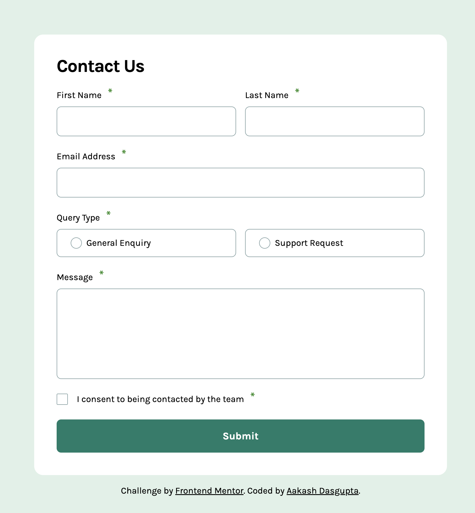
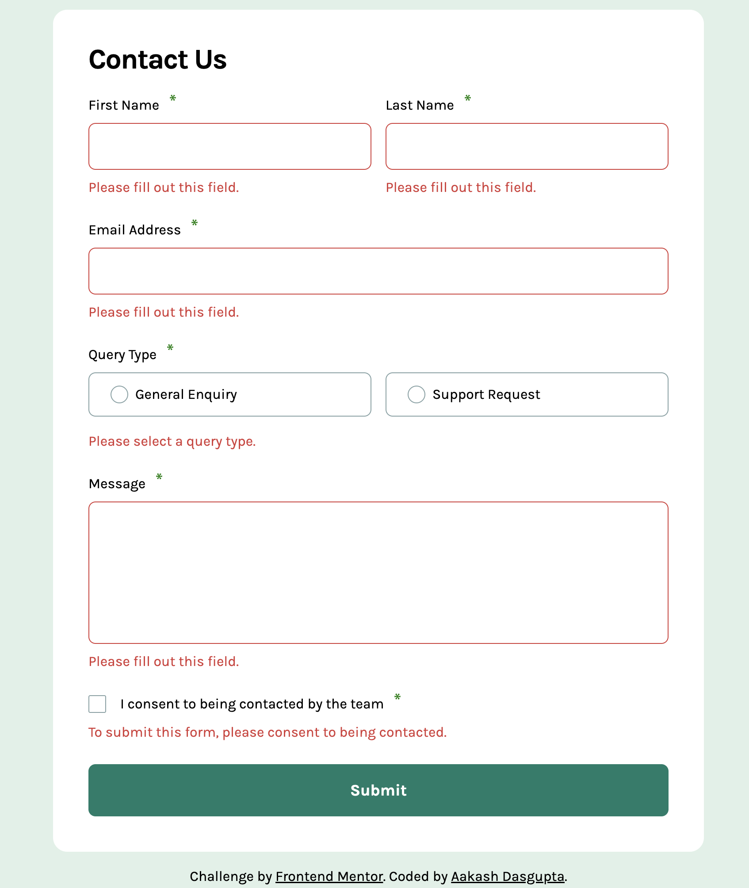
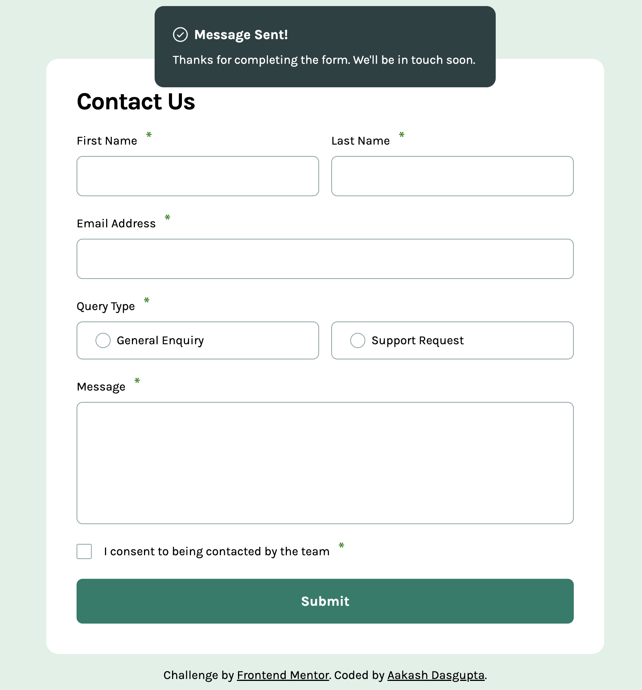

# Frontend Mentor - Contact form solution

This is a solution to the [Contact form challenge on Frontend Mentor](https://www.frontendmentor.io/challenges/contact-form--G-hYlqKJj). Frontend Mentor challenges help you improve your coding skills by building realistic projects. 

## Table of contents

- [Overview](#overview)
  - [The challenge](#the-challenge)
  - [Screenshot](#screenshot)
  - [Links](#links)
- [My process](#my-process)
  - [Built with](#built-with)
  - [What I learned](#what-i-learned)
  - [Continued development](#continued-development)
  - [Useful resources](#useful-resources)
- [Author](#author)

## Overview

### The challenge

Users should be able to:

- Complete the form and see a success toast message upon successful submission
- Receive form validation messages if:
  - A required field has been missed
  - The email address is not formatted correctly
- Complete the form only using their keyboard
- Have inputs, error messages, and the success message announced on their screen reader
- View the optimal layout for the interface depending on their device's screen size
- See hover and focus states for all interactive elements on the page

### Screenshot
<table align="center">
  <tr>
    <td></td>
    <td></td>
    <td></td>
  </tr>
  <tr align="center">
    <td>Normal View</td>
    <td>Error View</td>
    <td>Submitted View</td>
  </tr>
</table>

### Links

- Solution URL: [Link](https://github.com/a-d14)
- Live Site URL: [Link](https://a-d14.github.io/contact-form-frontend-mentor/)

## My process

### Built with

- Semantic HTML5 markup
- CSS custom properties
- Flexbox
- Mobile-first workflow
- Vanilla JS

### What I learned
I learned how to make forms accessible to those with disabilities. It was a great learning experience and introduced me to a completely new subject in front-end development.

### Continued development
I wish to learn more about accessibility in the future and incorporate them in projects.

### Useful resources
- [Accessibility Developer Guide](https://www.accessibility-developer-guide.com/examples/forms/required/) - The semantic and accessible way to include asterisk to indicate required form fields.

## Author
- Frontend Mentor - [@a-d14](https://www.frontendmentor.io/profile/a-d14)
- Twitter - [@brownRasgulla](https://x.com/brownRasgulla)